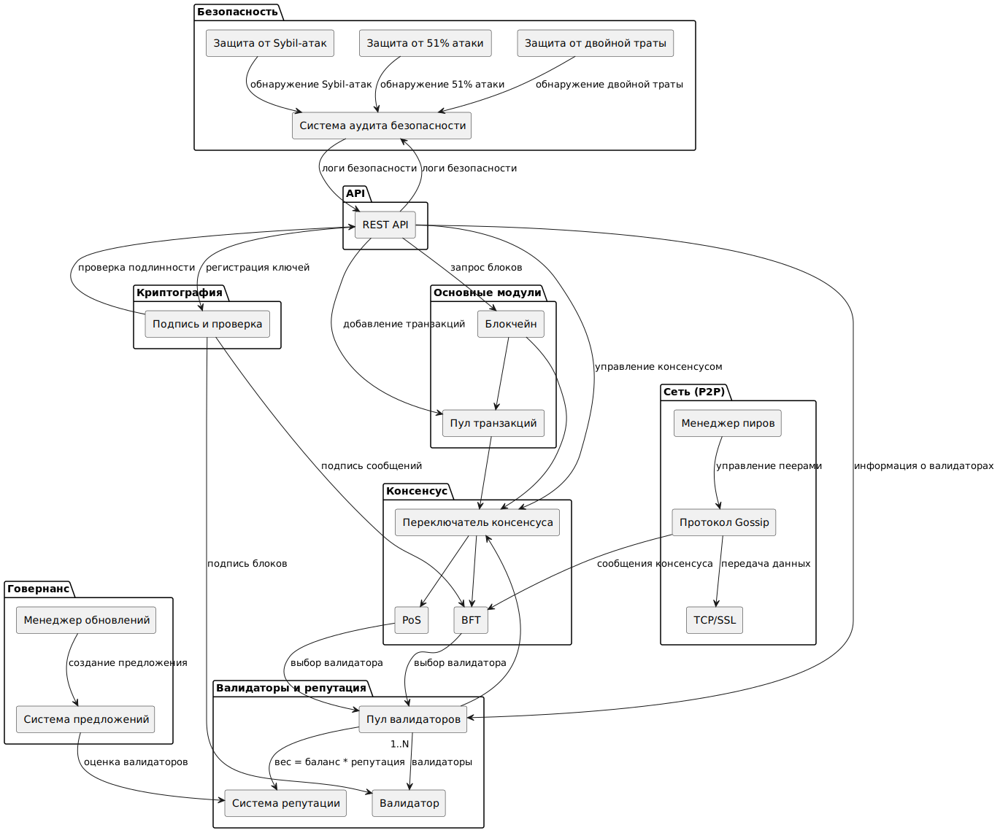
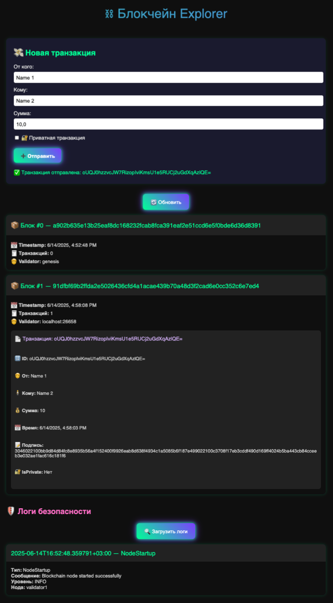

# Документация проекта: Блокчейн с поддержкой PoS и BFT

## Общее описание

Этот проект реализует блокчейн с поддержкой двух алгоритмов консенсуса:
- **PoS (Proof-of-Stake)** — доказательство доли
- **BFT (Byzantine Fault Tolerance)** — толерантность к византийским сбоям

Проект состоит из двух частей:
1. **/blockchain** — серверная часть блокчейна
2. **/client** — клиентская часть для взаимодействия с блокчейном через REST API и веб-интерфейс

Проект включает в себя:
- Модули криптографии и подписи
- Сетевые компоненты для коммуникации между узлами
- Хранилище блокчейна и пула транзакций
- Механизмы безопасности
- Говернанс и управление обновлениями
- REST API и клиентский веб-интерфейс

---

## Архитектура проекта



```
blockchain/
├── consensus/         # Модуль консенсуса
│   ├── manager/         # Менеджер консенсуса
│   ├── pos/             # Реализация PoS
│   └── bft/             # Реализация BFT
├── crypto/            # Криптографические функции
│   └── signature/       # Подписи и ключи
├── network/           # Сетевые компоненты
│   ├── gossip/          # Протокол рассылки
│   ├── peer/            # Управление пирингом
│   └── p2p/             # P2P-соединения
├── storage/           # Хранилище данных
│   ├── blockchain/      # Блокчейн
│   └── txpool/          # Пул транзакций
├── security/          # Механизмы безопасности
│   ├── audit/           # Аудит безопасности
│   ├── double_spend/    # Защита от двойной траты
│   ├── fiftyone/        # Защита от 51% атак
│   └── sybil/           # Защита от Sybil-атак
├── governance/        # Говернанс
│   ├── reputation/      # Репутационная система
│   └── upgrade/         # Управление обновлениями
├── integration/       # Интеграционные компоненты
│   └── api/             # REST API
└── main.go            # Точка входа

client/
├── main.go              # Клиентская часть
└── index.html           # Веб-интерфейс
```

---

## Основные модули

### 1. Модуль консенсуса

#### 1.1 Менеджер консенсуса (`consensus/manager/switcher.go`)
- Реализует переключение между алгоритмами PoS и BFT

#### 1.2 Реализация PoS (`consensus/pos/`)
- **stake.go** — модель ставок
- **validator.go** — модель валидатора
- **election.go** — выбор валидатора на основе стейка и репутации

#### 1.3 Реализация BFT (`consensus/bft/`)
- **tendermint.go** — реализация консенсуса Tendermint
- **round.go** — структура раунда консенсуса
- **message.go** — типы сообщений BFT
- **handler.go** — обработка сообщений BFT
- **tcp.go** — TCP-сервер для BFT-нод
- **node.go** — точка входа узла

### 2. Криптографические функции

- **crypto/signature/** — реализация подписей и ключей
  - **ecdsa.go** — реализация ECDSA подписей
  - **signer.go** — интерфейс подписывающего объекта
  - **keys.go** — работа с публичными ключами
  - **registry.go** — реестр публичных ключей
  - **sign.go** — функции подписи
  - **verify.go** — функции проверки подписи

### 3. Сетевые компоненты

#### 3.1 Протокол рассылки
- **network/gossip/gossip.go** — базовый протокол рассылки
- **network/gossip/message.go** — типы сообщений
- **network/gossip/consensus.go** — сообщения консенсуса

#### 3.2 Управление пирингом
- **network/peer/peer.go** — модель узла
- **network/peer/manager.go** — управление пирингом
- **network/peer/discovery.go** — обнаружение пиров
- **network/ping/pong.go** — проверка связи между узлами

#### 3.3 P2P-соединения
- **network/p2p/handshake.go** — рукопожатие между узлами
- **network/p2p/crypto.go** — TLS-конфигурация

### 4. Хранилище данных

#### 4.1 Блокчейн
- **storage/blockchain/chain.go** — реализация блокчейна
- **storage/blockchain/block.go** — модель блока

#### 4.2 Пул транзакций
- **storage/txpool/transaction.go** — модель транзакции
- **storage/txpool/pool.go** — пул транзакций
- **storage/txpool/utils.go** — вспомогательные функции

### 5. Механизмы безопасности

#### 5.1 Аудит безопасности
- **security/audit/logger.go** — логгер событий безопасности
- **security/audit/auditor.go** — аудитор безопасности

#### 5.2 Защита от двойной траты
- **security/double_spend/guard.go** — защита от двойной траты
- **security/double_spend/cache.go** — кэш транзакций

#### 5.3 Защита от 51% атак
- **security/fiftyone/guard.go** — защита от 51% атак
- **security/fiftyone/monitor.go** — мониторинг риска атак

#### 5.4 Защита от Sybil-атак
- **security/sybil/guard.go** — защита от Sybil-атак

### 6. Говернанс

#### 6.1 Репутационная система
- **governance/reputation/reputation.go** — репутационная система
- **governance/reputation/scorer.go** — расчет репутационных оценок
- **governance/reputation/validator_selector.go** — выбор валидатора

#### 6.2 Управление обновлениями
- **governance/upgrade/manager.go** — менеджер обновлений
- **governance/upgrade/strategy.go** — стратегии обновления

### 7. Интеграционные компоненты

- **integration/api/rest.go** — REST API для взаимодействия с блокчейном
- **integration/api/rpc.go** — RPC-интерфейс

### 8. Точка входа

- **main.go** — точка входа в приложение, инициализация всех компонентов

---

## REST API контракты

REST API предоставляет следующие эндпоинты:

### 1. **GET /blocks**
- **Описание**: Получение всех блоков из блокчейна
- **Запрос**: Нет
- **Ответ**:
  ```json
  [
    {
      "Index": 1,
      "Timestamp": 1718262000,
      "Data": "Genesis Block",
      "PrevHash": "",
      "Hash": "abc123...",
      "Validator": "validator1"
    }
  ]
  ```

### 2. **POST /transactions**
- **Описание**: Добавление новой транзакции в пул
- **Запрос**:
  ```json
  {
    "ID": "tx1",
    "From": "addr1",
    "To": "addr2",
    "Amount": 100,
    "Timestamp": 1718262000,
    "Signature": "signature",
    "IsPrivate": false
  }
  ```
- **Ответ**:
  ```json
  {
    "status": "success",
    "message": "Transaction added to pool"
  }
  ```

### 3. **GET /transactions**
- **Описание**: Получение всех транзакций из пула
- **Запрос**: Нет
- **Ответ**:
  ```json
  [
    {
      "ID": "tx1",
      "From": "addr1",
      "To": "addr2",
      "Amount": 100,
      "Timestamp": 1718262000,
      "Signature": "signature",
      "IsPrivate": false
    }
  ]
  ```

### 4. **POST /register**
- **Описание**: Регистрация публичного ключа для адреса
- **Запрос**:
  ```json
  {
    "address": "addr1",
    "pubKey": "pubkey_hex"
  }
  ```
- **Ответ**:
  ```json
  {
    "status": "success",
    "message": "Public key registered"
  }
  ```

### 5. **GET /audit**
- **Описание**: Получение событий безопасности
- **Запрос**: Нет
- **Ответ**:
  ```json
  [
    {
      "Timestamp": 1718262000,
      "Event": "Double spend attempt detected",
      "Details": "Transaction ID: tx1"
    }
  ]
  ```

---

## Клиентская часть: `/client`

### Основные файлы:

**`main.go`** — реализует:
- Генерацию ECDSA-ключей
- Подпись транзакций
- Отправку транзакций на сервер
- Регистрацию публичных ключей
- Простой веб-интерфейс для отправки транзакций

**`index.html`** — веб-интерфейс для отправки транзакций

---

## Функционал веб-интерфейса

### 1. **Описание**
Веб-интерфейс предоставляет простой способ создания и отправки транзакций через REST API. Он реализован на чистом HTML/JS без использования фреймворков.

### 2. **Функционал**

#### 2.1. Форма отправки транзакции
- **Поля формы**:
  - **From**: Адрес отправителя (строка)
  - **To**: Адрес получателя (строка)
  - **Amount**: Сумма перевода (число)
  - **IsPrivate**: Флаг приватной транзакции (true/false)

#### 2.2. Генерация ключей
- При отправке формы генерируются новые ECDSA-ключи:
  - Приватный ключ (hex)
  - Публичный ключ (hex, несжатый формат)

#### 2.3. Регистрация публичного ключа
- Публичный ключ регистрируется на сервере через `/register`

#### 2.4. Создание транзакции
- Генерируется ID транзакции
- Заполняются поля From, To, Amount, Timestamp
- Подписывается транзакция с использованием приватного ключа

#### 2.5. Отправка транзакции
- Подписанная транзакция отправляется на сервер через `/transactions`

#### 2.6. Ответ от сервера
- На экран выводится статус транзакции:
  - Успех: ✅ Транзакция отправлена
  - Ошибка: ❌ Сообщение об ошибке

---

## Технологии

- **Go** — язык программирования
- **TLS** — шифрование сетевого трафика
- **ECDSA** — алгоритм цифровой подписи
- **SHA-256** — хэширование данных
- **Gob/JSON** — сериализация данных

---

## Запуск и тестирование

### 1. Подготовка сертификатов
Система использует TLS для безопасного P2P-соединения. Необходимо сгенерировать сертификаты:

```bash
cd blockchain
mkdir -p certs
openssl genrsa -out certs/ca.key 4096
openssl req -new -x509 -days 365 -key certs/ca.key -out certs/ca.crt -subj "/CN=Test CA"
openssl genrsa -out certs/server.key 4096
openssl req -new -key certs/server.key -out certs/server.csr -subj "/CN=localhost"
openssl x509 -req -in certs/server.csr -CA certs/ca.crt -CAkey certs/ca.key -CAcreateserial -out certs/server.crt -days 365
```

### 2. Запуск серверной части

Перед запуском убедитесь, что сертификаты находятся в директории `blockchain/certs`.

```bash
cd blockchain
go run main.go
```

- Сервер будет доступен по адресу: `https://localhost:8081`
- TLS-проверка включена, используется сертификат из `blockchain/certs/server.crt`

---

### 3. Запуск клиентской части
```bash
cd client
go run main.go
```
- Веб-интерфейс будет доступен по адресу: `http://localhost:8000`

### 4. Тестирование через веб-интерфейс
1. Открыть `http://localhost:8000` в браузере
2. Заполнить форму:
  - From (адрес отправителя)
  - To (адрес получателя)
  - Amount (сумма)
  - IsPrivate (true/false)
3. Отправить транзакцию



### 5. Тестирование через curl
```bash
# Добавление транзакции
curl -X POST http://localhost:8081/transactions \
     -H "Content-Type: application/json" \
     -d '{
           "ID": "tx1",
           "From": "addr1",
           "To": "addr2",
           "Amount": 100,
           "Timestamp": 1718262000,
           "Signature": "signature"
         }'

# Регистрация публичного ключа
curl -X POST http://localhost:8081/register \
     -H "Content-Type: application/json" \
     -d '{
           "address": "addr1",
           "pubKey": "pubkey_hex"
         }'

# Получение всех блоков
curl http://localhost:8081/blocks

# Получение событий безопасности
curl http://localhost:8081/audit
```

---
