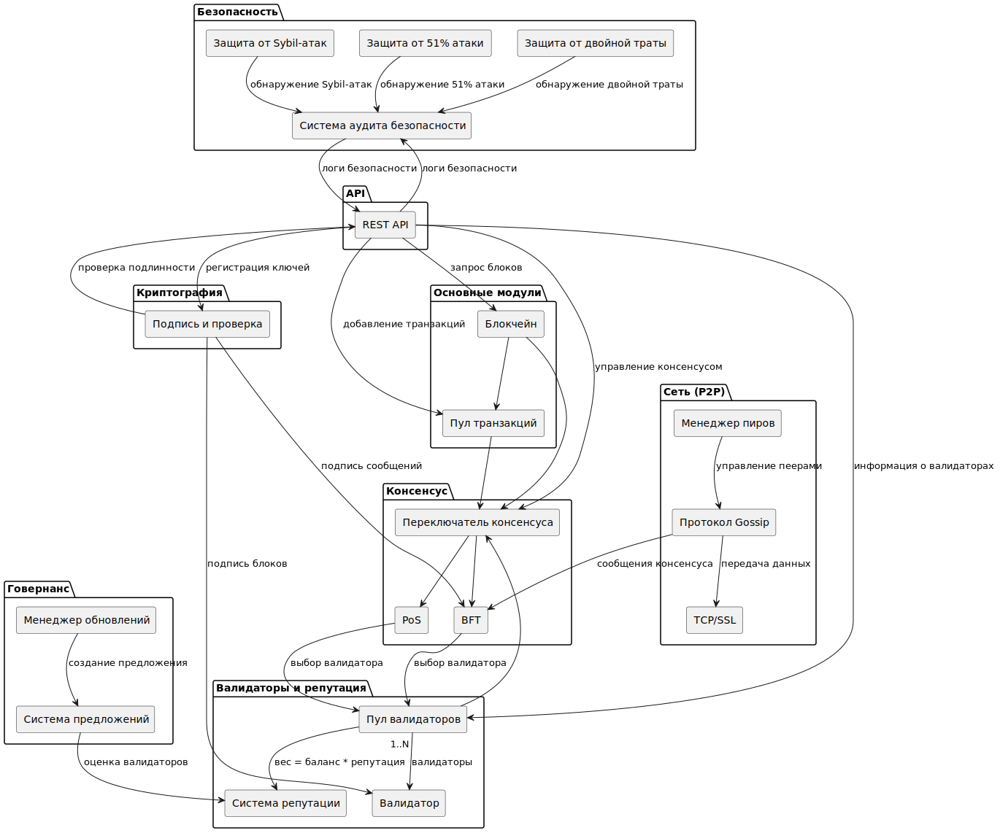
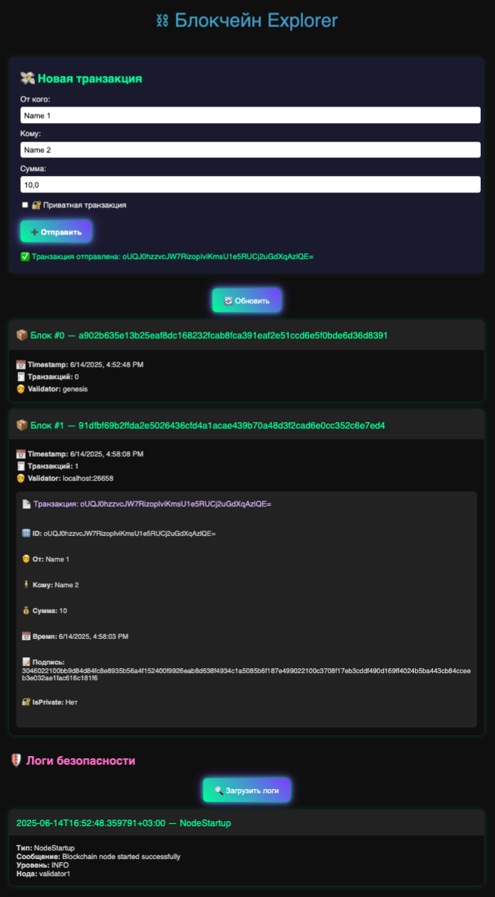

# Документация проекта: Блокчейн с поддержкой PoS и BFT

## Общее описание

Этот проект реализует блокчейн с поддержкой двух алгоритмов консенсуса:
- **PoS (Proof-of-Stake)** — доказательство доли
- **BFT (Byzantine Fault Tolerance)** — толерантность к византийским сбоям

Проект состоит из двух частей:
1. **/blockchain** — серверная часть блокчейна
2. **/client-send-transaction** — клиентская часть для взаимодействия с блокчейном через REST API и веб-интерфейс

Проект включает в себя:
- Модули криптографии и подписи
- Сетевые компоненты для коммуникации между узлами
- Хранилище блокчейна и пула транзакций
- Механизмы безопасности
- Говернанс и управление обновлениями
- REST API и клиентский веб-интерфейс
- Адаптивное шардирование с ARIMA-прогнозированием
- Мониторинг производительности (Prometheus)
- KYC/AML интеграция
- Приватные транзакции с ZKP

---

## Архитектура проекта



Диаграмма архитектуры в формате PlantUML: [architecture.puml](blockchain/architecture.puml)

```
blockchain/
├── consensus/         # Модуль консенсуса
│   ├── manager/         # Менеджер консенсуса (переключатель PoS/BFT)
│   ├── pos/             # Реализация PoS
│   ├── bft/             # Реализация BFT
│   └── governance/      # Говернанс консенсуса
├── crypto/            # Криптографические функции
│   └── signature/       # Подписи и ключи (ECDSA P-256)
├── network/           # Сетевые компоненты
│   ├── gossip/          # Протокол рассылки
│   ├── peer/            # Управление пирингом
│   ├── p2p/             # P2P-соединения
│   ├── ping/            # Ping/Pong для проверки связи
│   └── multiaddr/       # Мультиадресация
├── storage/           # Хранилище данных
│   ├── blockchain/      # Блокчейн
│   └── txpool/          # Пул транзакций
├── security/          # Механизмы безопасности
│   ├── audit/           # Аудит безопасности
│   ├── double_spend/    # Защита от двойной траты
│   ├── fiftyone/        # Защита от 51% атак
│   └── sybil/           # Защита от Sybil-атак
├── governance/        # Говернанс
│   ├── reputation/      # Репутационная система
│   ├── upgrade/         # Управление обновлениями
│   └── kyc/             # KYC/AML интеграция
├── scalability/       # Масштабирование
│   ├── sharding/        # Адаптивное шардирование (ARIMA)
│   ├── parallel/        # Параллельная обработка
│   └── offchain/        # Off-chain вычисления
├── privacy/           # Приватность
│   └── zkp/             # Zero-Knowledge Proofs
├── monitoring/        # Мониторинг производительности
│   ├── metrics.go       # Prometheus метрики
│   └── server.go        # Сервер метрик
├── integration/       # Интеграционные компоненты
│   ├── api/             # REST API
│   ├── financial/       # Финансовая интеграция (ISO 20022)
│   └── rpc.go           # RPC-интерфейс
├── contracts/         # Смарт-контракты (в разработке)
├── examples/          # Примеры использования
├── benchmark/         # Бенчмарки
├── main.go            # Точка входа
└── certs/             # TLS сертификаты

client/
├── main.go              # Клиентская часть
├── index.html           # Веб-интерфейс
└── client               # Скомпилированный бинарник
```

---

## Основные модули

### 1. Модуль консенсуса

#### 1.1 Менеджер консенсуса (`consensus/manager/switcher.go`)
- Реализует переключение между алгоритмами PoS и BFT
- Единый интерфейс для обоих алгоритмов
- Поддержка работы в шардированной среде

#### 1.2 Реализация PoS (`consensus/pos/`)
- **stake.go** — модель ставок
- **validator.go** — модель валидатора
- **election.go** — выбор валидатора на основе стейка и репутации

#### 1.3 Реализация BFT (`consensus/bft/`)
- **tendermint.go** — реализация консенсуса Tendermint
- **round.go** — структура раунда консенсуса
- **message.go** — типы сообщений BFT
- **handler.go** — обработка сообщений BFT
- **tcp.go** — TCP-сервер для BFT-нод
- **node.go** — точка входа узла

#### 1.4 Говернанс консенсуса (`consensus/governance/`)
- Управление параметрами консенсуса
- Предложения и голосования

### 2. Криптографические функции

- **crypto/signature/** — реализация подписей и ключей
  - **ecdsa.go** — реализация ECDSA подписей (P-256)
  - **signer.go** — интерфейс подписывающего объекта
  - **keys.go** — работа с публичными ключами
  - **registry.go** — реестр публичных ключей
  - **sign.go** — функции подписи
  - **verify.go** — функции проверки подписи

### 3. Сетевые компоненты

#### 3.1 Протокол рассылки
- **network/gossip/gossip.go** — базовый протокол рассылки
- **network/gossip/message.go** — типы сообщений
- **network/gossip/consensus.go** — сообщения консенсуса

#### 3.2 Управление пирингом
- **network/peer/peer.go** — модель узла
- **network/peer/manager.go** — управление пирингом
- **network/peer/discovery.go** — обнаружение пиров

#### 3.3 P2P-соединения
- **network/p2p/handshake.go** — рукопожатие между узлами
- **network/p2p/crypto.go** — TLS-конфигурация

#### 3.4 Проверка связи
- **network/ping/pong.go** — Ping/Pong для проверки узлов

#### 3.5 Мультиадресация
- **network/multiaddr/** — поддержка мультиадресов

### 4. Хранилище данных

#### 4.1 Блокчейн
- **storage/blockchain/chain.go** — реализация блокчейна
- **storage/blockchain/block.go** — модель блока

#### 4.2 Пул транзакций
- **storage/txpool/transaction.go** — модель транзакции
- **storage/txpool/pool.go** — пул транзакций
- **storage/txpool/utils.go** — вспомогательные функции

### 5. Механизмы безопасности

#### 5.1 Аудит безопасности
- **security/audit/logger.go** — логгер событий безопасности
- **security/audit/auditor.go** — аудитор безопасности

#### 5.2 Защита от двойной траты
- **security/double_spend/guard.go** — защита от двойной траты
- **security/double_spend/cache.go** — кэш транзакций

#### 5.3 Защита от 51% атак
- **security/fiftyone/guard.go** — защита от 51% атак
- **security/fiftyone/monitor.go** — мониторинг риска атак

#### 5.4 Защита от Sybil-атак
- **security/sybil/guard.go** — защита от Sybil-атак

### 6. Говернанс

#### 6.1 Репутационная система
- **governance/reputation/reputation.go** — репутационная система
- **governance/reputation/scorer.go** — расчет репутационных оценок
- **governance/reputation/validator_selector.go** — выбор валидатора

#### 6.2 Управление обновлениями
- **governance/upgrade/manager.go** — менеджер обновлений
- **governance/upgrade/strategy.go** — стратегии обновления

#### 6.3 KYC/AML интеграция
- **governance/kyc/kyc.go** — KYC/AML менеджер
- Регистрация и верификация пользователей
- Проверка статуса KYC
- Отчётность о подозрительной активности

### 7. Масштабирование

#### 7.1 Адаптивное шардирование
- **scalability/sharding/shard.go** — модель шарда
- **scalability/sharding/adaptive_sharding.go** — менеджер адаптивного шардирования
- **scalability/sharding/router.go** — маршрутизатор транзакций
- **scalability/sharding/forecast.go** — ARIMA(1,1,1) прогнозист нагрузки
- Автоматическое масштабирование: 1-8 шардов
- Прогнозирование нагрузки на 5 шагов вперёд

#### 7.2 Параллельная обработка
- **scalability/parallel/** — параллельное выполнение транзакций

#### 7.3 Off-chain вычисления
- **scalability/offchain/** — вычисления вне цепочки

### 8. Приватность

#### 8.1 Zero-Knowledge Proofs
- **privacy/zkp/** — доказательства с нулевым разглашением
- Приватные транзакции

### 9. Мониторинг

#### 9.1 Prometheus метрики
- **monitoring/metrics.go** — определение метрик
- **monitoring/server.go** — сервер метрик
- **monitoring/README.md** — документация по мониторингу

**Доступные метрики:**
- `blockchain_tps` — транзакции в секунду
- `blockchain_block_time_seconds` — время создания блока
- `blockchain_network_latency_seconds` — задержка сети
- `blockchain_cpu_usage_percent` — использование CPU
- `blockchain_memory_usage_bytes` — использование памяти
- `blockchain_active_peers` — активные пиры
- `blockchain_total_transactions` — всего транзакций
- `blockchain_total_blocks` — всего блоков
- `blockchain_pending_transactions` — транзакции в ожидании
- `blockchain_failed_transactions` — неудачные транзакции

**Endpoint:** `http://localhost:9090/metrics`

### 10. Интеграционные компоненты

#### 10.1 REST API
- **integration/api/rest.go** — REST API сервер
- **integration/api/rpc.go** — RPC-интерфейс

#### 10.2 Финансовая интеграция
- **integration/financial/iso20022.go** — интеграция с ISO 20022
- **integration/financial/benchmark_test.go** — бенчмарки

### 11. Точка входа

- **main.go** — точка входа в приложение, инициализация всех компонентов

---

## REST API контракты

REST API предоставляет следующие эндпоинты:

### 1. **GET /blocks**
- **Описание**: Получение всех блоков из блокчейна
- **Запрос**: Нет
- **Ответ**:
  ```json
  [
    {
      "Index": 1,
      "Timestamp": 1718262000,
      "Data": "Genesis Block",
      "PrevHash": "",
      "Hash": "abc123...",
      "Validator": "validator1"
    }
  ]
  ```

### 2. **POST /transactions**
- **Описание**: Добавление новой транзакции в пул
- **Запрос**:
  ```json
  {
    "ID": "tx1",
    "From": "addr1",
    "To": "addr2",
    "Amount": 100,
    "Fee": 0.001,
    "Timestamp": 1718262000,
    "Signature": "signature",
    "IsPrivate": false
  }
  ```
- **Ответ**:
  ```json
  {
    "status": "success",
    "message": "Transaction added to pool"
  }
  ```

### 3. **GET /transactions**
- **Описание**: Получение всех транзакций из пула
- **Запрос**: Нет
- **Ответ**:
  ```json
  [
    {
      "ID": "tx1",
      "From": "addr1",
      "To": "addr2",
      "Amount": 100,
      "Fee": 0.001,
      "Timestamp": 1718262000,
      "Signature": "signature",
      "IsPrivate": false
    }
  ]
  ```

### 4. **POST /register**
- **Описание**: Регистрация публичного ключа для адреса
- **Запрос**:
  ```json
  {
    "address": "addr1",
    "pubKey": "pubkey_hex"
  }
  ```
- **Ответ**:
  ```json
  {
    "status": "success",
    "message": "Public key registered"
  }
  ```

### 5. **GET /audit**
- **Описание**: Получение событий безопасности
- **Запрос**: Нет
- **Ответ**:
  ```json
  [
    {
      "Timestamp": 1718262000,
      "Type": "DoubleSpendAttempt",
      "Message": "Double spend attempt detected",
      "Details": "Transaction ID: tx1",
      "Severity": "HIGH"
    }
  ]
  ```

### 6. **POST /kyc/register**
- **Описание**: Регистрация пользователя в системе KYC/AML
- **Запрос**:
  ```json
  {
    "address": "addr1",
    "fullName": "John Doe",
    "idNumber": "ID123456",
    "country": "RU"
  }
  ```
- **Ответ**:
  ```json
  {
    "status": "success",
    "message": "KYC registration initiated"
  }
  ```

### 7. **POST /kyc/verify**
- **Описание**: Верификация KYC статуса пользователя
- **Запрос**:
  ```json
  {
    "address": "addr1"
  }
  ```
- **Ответ**:
  ```json
  {
    "status": "success",
    "message": "KYC verified"
  }
  ```

### 8. **GET /kyc/status/:address**
- **Описание**: Проверка статуса KYC пользователя
- **Запрос**: Нет
- **Ответ**:
  ```json
  {
    "status": "Verified",
    "riskScore": 0.15
  }
  ```

### 9. **POST /kyc/report-suspicious**
- **Описание**: Сообщение о подозрительной активности
- **Запрос**:
  ```json
  {
    "address": "addr1",
    "reason": "Unusual transaction pattern"
  }
  ```

### 10. **GET /kyc/compliance-report**
- **Описание**: Отчёт о соответствии требованиям AML
- **Запрос**: Нет

### 11. **GET /metrics**
- **Описание**: Prometheus метрики производительности
- **Запрос**: Нет
- **Порт**: 9090
- **Ответ**: Текст в формате Prometheus

---

## Клиентская часть: `/client-send-transaction`

### Основные файлы:

**`main.go`** — реализует:
- Генерацию ECDSA-ключей
- Подпись транзакций
- Отправку транзакций на сервер
- Регистрацию публичных ключей
- Простой веб-интерфейс для отправки транзакций
- KYC endpoints (регистрация, верификация, проверка статуса)

**`index.html`** — веб-интерфейс для отправки транзакций

**`client`** — скомпилированный бинарник

---

## Функционал веб-интерфейса

### 1. **Описание**
Веб-интерфейс предоставляет простой способ создания и отправки транзакций через REST API. Он реализован на чистом HTML/JS без использования фреймворков.

### 2. **Функционал**

#### 2.1. Форма отправки транзакции
- **Поля формы**:
  - **From**: Адрес отправителя (строка)
  - **To**: Адрес получателя (строка)
  - **Amount**: Сумма перевода (число)
  - **Fee**: Комиссия (число)
  - **IsPrivate**: Флаг приватной транзакции (true/false)

#### 2.2. Генерация ключей
- При отправке формы генерируются новые ECDSA-ключи:
  - Приватный ключ (hex)
  - Публичный ключ (hex, несжатый формат, 130 символов)

#### 2.3. Регистрация публичного ключа
- Публичный ключ регистрируется на сервере через `/register`

#### 2.4. Создание транзакции
- Генерируется ID транзакции
- Заполняются поля From, To, Amount, Fee, Timestamp
- Подписывается транзакция с использованием приватного ключа

#### 2.5. Отправка транзакции
- Подписанная транзакция отправляется на сервер через `/transactions`

#### 2.6. Ответ от сервера
- На экран выводится статус транзакции:
  - Успех: ✅ Транзакция отправлена
  - Ошибка: ❌ Сообщение об ошибке

#### 2.7. KYC функционал
- Регистрация KYC через `/kyc/register`
- Верификация KYC через `/kyc/verify`
- Проверка статуса KYC через `/kyc/status/:address`

---

## Технологии

- **Go 1.21+** — язык программирования
- **TLS** — шифрование сетевого трафика
- **ECDSA P-256** — алгоритм цифровой подписи
- **SHA-256** — хэширование данных
- **Gob/JSON** — сериализация данных
- **Prometheus** — мониторинг производительности
- **ARIMA(1,1,1)** — прогнозирование нагрузки для шардирования
- **BadgerDB** — key-value хранилище
- **ISO 20022** — финансовый стандарт интеграции

---

## Запуск и тестирование

### 1. Подготовка сертификатов
Система использует TLS для безопасного P2P-соединения. Необходимо сгенерировать сертификаты:

```bash
cd blockchain
mkdir -p certs
openssl genrsa -out certs/ca.key 4096
openssl req -new -x509 -days 365 -key certs/ca.key -out certs/ca.crt -subj "/CN=Test CA"
openssl genrsa -out certs/server.key 4096
openssl req -new -key certs/server.key -out certs/server.csr -subj "/CN=localhost"
openssl x509 -req -in certs/server.csr -CA certs/ca.crt -CAkey certs/ca.key -CAcreateserial -out certs/server.crt -days 365
```

### 2. Сборка проекта

```bash
# Сборка blockchain-ноды
cd blockchain
go build -o blockchain-node .

# Сборка клиента
cd ../client-send-transaction
go build -o client .
```

### 3. Запуск серверной части

Перед запуском убедитесь, что сертификаты находятся в директории `blockchain/certs`.

```bash
cd blockchain
./blockchain-node
```

**Ожидаемый вывод:**
```
🚀 Starting Minimal Blockchain Node with Sharding...
🧱 Adaptive sharding initialized: min=1, max=8 shards
🔑 Public key registered for validator localhost:27656
🏷️ Validator 1: localhost:27656 | Stake: 2000
🔌 Starting REST API on :8081
✅ Node started with sharding support. Waiting for connections...
📊 Monitoring server started on http://:9090/metrics
```

- Сервер будет доступен по адресу: `https://localhost:8081`
- Метрики Prometheus: `http://localhost:9090/metrics`
- TLS-проверка включена, используется сертификат из `blockchain/certs/server.crt`

---

### 4. Запуск клиентской части
```bash
cd client-send-transaction
./client
```
- Веб-интерфейс будет доступен по адресу: `http://localhost:8000`

### 5. Тестирование через веб-интерфейс
1. Открыть `http://localhost:8000` в браузере
2. Заполнить форму:
  - From (адрес отправителя)
  - To (адрес получателя)
  - Amount (сумма)
  - Fee (комиссия)
  - IsPrivate (true/false)
3. Отправить транзакцию



### 6. Тестирование через curl
```bash
# Добавление транзакции
curl -X POST http://localhost:8081/transactions \
     -H "Content-Type: application/json" \
     -d '{
           "ID": "tx1",
           "From": "addr1",
           "To": "addr2",
           "Amount": 100,
           "Fee": 0.001,
           "Timestamp": 1718262000,
           "Signature": "signature",
           "IsPrivate": false
         }'

# Регистрация публичного ключа
curl -X POST http://localhost:8081/register \
     -H "Content-Type: application/json" \
     -d '{
           "address": "addr1",
           "pubKey": "pubkey_hex"
         }'

# KYC регистрация
curl -X POST http://localhost:8081/kyc/register \
     -H "Content-Type: application/json" \
     -d '{
           "address": "addr1",
           "fullName": "John Doe",
           "idNumber": "ID123456",
           "country": "RU"
         }'

# KYC верификация
curl -X POST http://localhost:8081/kyc/verify \
     -H "Content-Type: application/json" \
     -d '{"address": "addr1"}'

# Получение всех блоков
curl http://localhost:8081/blocks

# Получение событий безопасности
curl http://localhost:8081/audit

# Получение метрик Prometheus
curl http://localhost:9090/metrics
```

---

## 🧪 Тестирование системы

### Быстрая проверка (5 минут)

```bash
# 1. Очистка порта (если занят)
pkill -f blockchain-node
sleep 2

# 2. Запуск сервера
cd blockchain
./blockchain-node &

# 3. Проверка API (через 3 секунды)
sleep 3
curl http://localhost:8081/blocks

# 4. Тест регистрации (нужен реальный ключ!)
cd ..
go run generate_keys.go  # Сгенерируйте ключ
# Скопируйте публичный ключ из вывода

# 5. Остановка
pkill -f blockchain-node
```

**Или используйте готовый тестовый скрипт:**
```bash
./test_register.sh  # Автоматический тест регистрации
```

### Полное тестирование

#### 1. Подготовка и сборка

```bash
cd /PATH_TO_REPO/Blockchain

# Сборка blockchain-ноды
cd blockchain
go build -o blockchain-node .

# Сборка клиента
cd ../client-send-transaction
go build -o client .
```

#### 2. Запуск сервера

```bash
cd blockchain
./blockchain-node
```

**Ожидаемый вывод:**
```
🚀 Starting Minimal Blockchain Node with Sharding...
🧱 Adaptive sharding initialized: min=1, max=8 shards
🔑 Public key registered for validator localhost:27656
🏷️ Validator 1: localhost:27656 | Stake: 2000
🔌 Starting REST API on :8081
✅ Node started with sharding support. Waiting for connections...
📊 Monitoring server started on http://:9090/metrics
```

#### 3. Проверка API endpoints

```bash
# Проверка блоков
curl -s http://localhost:8081/blocks | python3 -m json.tool

# Проверка транзакций
curl -s http://localhost:8081/transactions

# Проверка аудита
curl -s http://localhost:8081/audit

# Проверка метрик (Prometheus)
curl -s http://localhost:9090/metrics | head -20
```

#### 4. Тестирование полного цикла транзакции

```bash
# Переменные
API="http://localhost:8081"
USER="testuser_$(date +%s)"

# 1. Генерация ключей
go run generate_keys.go
# Скопируйте публичный ключ (130 hex символов, начинается с 04)

# 2. Регистрация публичного ключа
curl -X POST "$API/register" \
  -H "Content-Type: application/json" \
  -d "{\"address\":\"$USER\",\"pubKey\":\"<реальный_ключ_из_130_hex_символов>\"}"

# 3. KYC регистрация
curl -X POST "$API/kyc/register" \
  -H "Content-Type: application/json" \
  -d "{\"address\":\"$USER\",\"fullName\":\"Test User\",\"idNumber\":\"ID123456\",\"country\":\"RU\"}"

# 4. KYC верификация
curl -X POST "$API/kyc/verify" \
  -H "Content-Type: application/json" \
  -d "{\"address\":\"$USER\"}"

# 5. Проверка статуса KYC
curl "$API/kyc/status/$USER"

# 6. Отправка транзакции (нужна правильная подпись)
curl -X POST "$API/transactions" \
  -H "Content-Type: application/json" \
  -d "{\"ID\":\"tx-test\",\"From\":\"$USER\",\"To\":\"recipient\",\"Amount\":100,\"Fee\":0.001,\"Timestamp\":$(date +%s),\"Signature\":\"30440220...\",\"IsPrivate\":false}"
```

#### 5. Тестирование веб-интерфейса

```bash
# Запуск клиента
cd client-send-transaction
./client
```

Откройте в браузере: **http://localhost:8000**

1. Заполните форму:
   - **From**: `user1`
   - **To**: `user2`
   - **Amount**: `100`
   - **Fee**: `0.001`
   - **IsPrivate**: `false`
2. Нажмите **Отправить**
3. Проверьте результат в консоли сервера

#### 6. Мониторинг консенсуса

```bash
# Наблюдение за созданием блоков в реальном времени
watch -n 2 'curl -s http://localhost:8081/blocks | python3 -c "import sys,json; b=json.load(sys.stdin); print(f\"Блоков: {len(b)}, Последний: #{b[-1].get(\"index\",0) if b else 0}\")"'
```

#### 7. Автоматические тесты

```bash
# Тест регистрации
./test_register.sh

# Тест KYC
./test_kyc.sh

# Тест блоков
./test_blocks.sh
```

---

## 🔧 Диагностика и решение проблем

### Частые ошибки

| Ошибка | Причина | Решение |
|--------|---------|---------|
| `connection refused` | Сервер не запущен | Запустите `./blockchain-node` |
| `Invalid transaction signature` | Ключ не зарегистрирован или KYC не пройден | Сначала `/register`, затем `/kyc/register` и `/kyc/verify` |
| `address already in use` | Порт 8081 или 9090 занят | `pkill -f blockchain-node` и перезапустите |
| `Failed to parse public key` | Неверный формат ключа | Используйте `go run generate_keys.go` для генерации |
| `sender not verified` | KYC статус Pending | Вызовите `/kyc/verify` для подтверждения |

### Очистка и перезапуск

```bash
# Убить все процессы
pkill -f blockchain-node
pkill -f client

# Пересобрать
cd blockchain && go build -o blockchain-node .
cd ../client-send-transaction && go build -o client .

# Запустить заново
cd ../blockchain && ./blockchain-node
```

### Генерация ключей

Для тестирования через API нужны реальные ключи:

```bash
# Сгенерировать пару ключей
go run generate_keys.go

# Пример вывода:
# 🔑 Генерация пары ключей ECDSA P-256...
#
# Приватный ключ (hex):
#   abc123...
#
# Публичный ключ (hex, 130 символов):
#   04a1b2c3d4e5f6...
```

**Важно:** Публичный ключ должен быть:
- 130 hex символов (65 байт)
- Начинаться с `04` (несжатый формат)
- Содержать действительную точку на кривой P-256

### Чек-лист успешного тестирования

- [ ] Сервер запускается без ошибок
- [ ] `GET /blocks` возвращает список блоков
- [ ] `GET /transactions` возвращает пул транзакций
- [ ] `POST /register` принимает публичный ключ
- [ ] `POST /kyc/register` регистрирует пользователя
- [ ] `POST /kyc/verify` подтверждает KYC
- [ ] `GET /kyc/status/:address` возвращает статус
- [ ] `POST /transactions` принимает транзакции (статус 200)
- [ ] PoS консенсус создаёт новые блоки каждые 10 секунд
- [ ] Метрики доступны на `http://localhost:9090/metrics`
- [ ] Веб-интерфейс открывается на `http://localhost:8000`
- [ ] Адаптивное шардирование работает (1-8 шардов)

---

## 📊 API Reference

| Endpoint | Метод | Описание |
|----------|-------|----------|
| `/blocks` | GET | Получить все блоки |
| `/transactions` | GET | Получить транзакции из пула |
| `/transactions` | POST | Добавить транзакцию |
| `/register` | POST | Зарегистрировать публичный ключ |
| `/kyc/register` | POST | Регистрация на KYC |
| `/kyc/verify` | POST | Верификация KYC |
| `/kyc/status/:address` | GET | Проверка статуса KYC |
| `/kyc/report-suspicious` | POST | Сообщение о подозрительной активности |
| `/kyc/compliance-report` | GET | Отчёт о соответствии |
| `/audit` | GET | События безопасности |
| `/metrics` | GET | Prometheus метрики (порт 9090) |

---

## 📈 Производительность

### Целевые показатели

- **Пропускная способность**: ≥1000 TPS (BFT), ≥850 TPS (PoS)
- **Время подтверждения**: <2с (BFT), <5с (PoS)
- **Масштабирование**: 1-8 шардов (адаптивно)
- **Прогнозирование**: ARIMA(1,1,1), горизонт 5 шагов

### Бенчмарки

```bash
# Запуск бенчмарков
cd blockchain
go test -bench=. ./benchmark/...

# Тест производительности
go test -bench=. ./performance_test.go
```

---

## 🔗 Дополнительные ресурсы

- [Мониторинг производительности](blockchain/monitoring/README.md)
- [Диаграмма архитектуры](blockchain/architecture.puml)
- [Примеры использования](blockchain/examples/)
- [Бенчмарки](blockchain/benchmark/)

---
